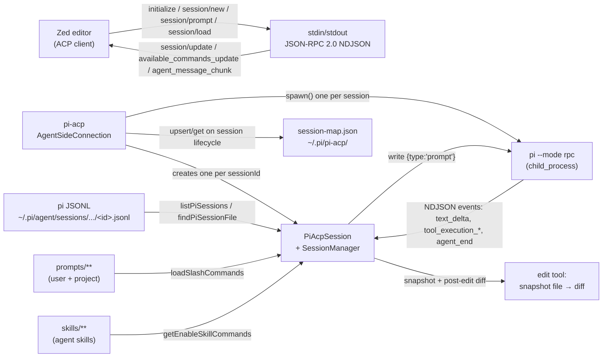
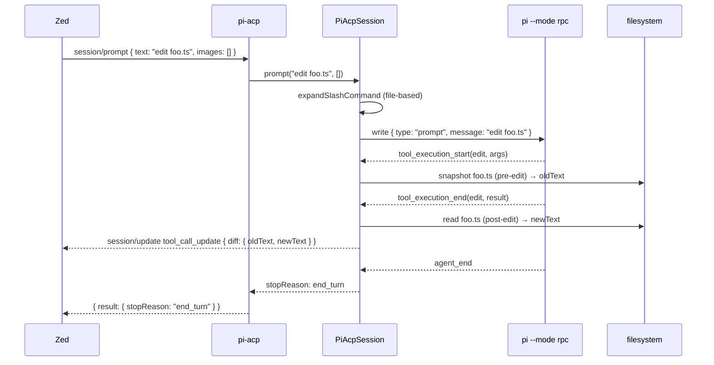

# Architecture

The repository follows the constraint documented in `AGENTS.md`: **one ACP session maps to one `pi --mode rpc` subprocess**. Pi's RPC mode is effectively single-session, so the adapter cannot multiplex multiple ACP sessions over a single pi process; instead, `session/new` spawns a dedicated child with `--session <path>` so the JSONL persistence stays where the regular `pi` CLI can find it. The adapter itself is a thin process tree: an `AgentSideConnection` (from `@agentclientprotocol/sdk`) bound to `ndJsonStream(stdin, stdout)` at the top, a `SessionManager` keyed by ACP `sessionId`, and a `PiRpcProcess` per session that owns the `child_process` handle.



## Key components

| File | Purpose |
| --- | --- |
| `src/index.ts` | Process entry. Branches on `--terminal-login` (spawnSync `'pi'`) and `--ws` (`startWsServer`); otherwise wraps `process.stdin`/`process.stdout` as ACP NDJSON and constructs `new AgentSideConnection((conn) => new PiAcpAgent(conn), stream)`. Catches `ERR_STREAM_DESTROYED` on the writable side so the adapter doesn't crash when the client closes stdout early. |
| `src/acp/agent.ts` | `PiAcpAgent implements ACPAgent`. Owns `initialize`, `newSession`, `unstable_loadSession`, `unstable_resumeSession`, `unstable_listSessions`, `unstable_forkSession`, `prompt`, `cancel`, `setSessionMode`, `unstable_setSessionModel`, `authenticate`. Holds the `SessionManager`, the `SessionStore`, `lastSessionCwd` (for list-scoped default), and `buildStartupInfo` for the Zed startup-info block. |
| `src/acp/session.ts` | `SessionManager` (Map of ACP `sessionId` → `PiAcpSession`) + `PiAcpSession` (turn queue, tool-call status map, edit snapshots, serialized `emit()`). `handlePiEvent` is the single switch over pi's NDJSON event types. |
| `src/acp/translate/prompt.ts` | `promptToPiMessage(blocks)` — turns `text` into `message`, turns `resource_link` into a `\n[Context] <uri>` line, encodes `resource` (text vs base64 blob) and emits `[Embedded Context] uri (mime, N bytes)`. Audio blocks become a `[Audio] not supported by pi-acp` marker (we don't silently drop context). |
| `src/acp/translate/pi-tools.ts` | `toolResultToText(result)` — handles `content[]`, `details.{stdout, stderr, exitCode, diff}`, JSON fallback. Used both for streaming tool updates and for the replay path in `loadSession`. |
| `src/acp/translate/pi-messages.ts` | `normalizePiMessageText` + `normalizePiAssistantText` — collapse pi's content blocks into a single string for the replay path. |
| `src/acp/slash-commands.ts` | File-based slash commands: `loadSlashCommands(cwd)` reads `~/.pi/agent/prompts/**/*.md` and `<cwd>/.pi/prompts/**/*.md`, `parseCommandArgs` handles bash-style quoting, `substituteArgs` does `$1`/`$@`, `expandSlashCommand` does the per-message lookup. Mirrors pi's terminal behavior since pi RPC mode skips this. |
| `src/acp/pi-commands.ts` | `toAvailableCommandsFromPiGetCommands(data, { translate })` — turns pi's `get_commands` response into ACP `AvailableCommand[]`. Hides `source: 'extension'` unless explicitly allowed; filters `skill:*` by `enableSkillCommands`; falls back to `(source:location)` description. |
| `src/acp/pi-settings.ts` | `getEnableSkillCommands(cwd)` — reads `<agentDir>/settings.json` and `<cwd>/.pi/settings.json`, deep-merges with project-overrides-global, accepts `enableSkillCommands` or `skills.enableSkillCommands`. |
| `src/acp/pi-sessions.ts` | `listPiSessions()` — walks `~/.pi/agent/sessions/**/*.jsonl`, reads the first 64 KiB to find the `type:"session"` header, the last 256 KiB to find `session_info.name` and the most recent `message.timestamp`, and falls back to a full-file scan if the tail window missed the name. `findPiSessionFile(sessionId)` is the lookup used by `loadSession` and `forkSession`. |
| `src/acp/session-store.ts` | `SessionStore` — versioned `version:1` JSON file at `~/.pi/pi-acp/session-map.json`. `upsert({sessionId, cwd, sessionFile})` is called on `newSession`, `loadSession`, and `forkSession`. The mapping is the fast path; `findPiSessionFile` is the fallback. |
| `src/acp/auth.ts` | `getAuthMethods(opts)` — returns a single `AuthMethod` with both the registry-required `type/args/env` shape (`type: "terminal", args: ["--terminal-login"]`) and the `_meta["terminal-auth"]` block Zed uses to render the Authenticate banner. The launch spec is derived from `process.argv[0]`/`[1]` so a `node /path/to/dist/index.js` invocation is reusable as the launch command. |
| `src/acp/auth-required.ts` | `maybeAuthRequiredError(err)` — substring-based detector for the most common missing-credential errors (`api key`, `unauthorized`, `401`, `403`, etc.). Used as a fallback during prompt failure to surface `auth_required` instead of a raw `internal_error`. |
| `src/acp/protocol.ts` | `ACPMethods` const + `ErrorCode` enum. JSON-RPC standard codes (`-32700`, `-32600`, `-32601`, `-32602`, `-32603`, `-32000`) plus ACP extensions (`-32001 SessionNotFound` ... `-32010 GenUIActionFailed`). |
| `src/acp/errors.ts` | `ACPError` (with `toJSON()` returning `{code, message, data?}`), `InvalidParamsError`, `InternalError`, `AuthRequiredError`, `MethodNotFoundError`. Type guards `isACPError`, `isInvalidParamsError`, etc. |
| `src/acp/paths.ts` | `getPiAcpDir()` / `getPiAcpSessionMapPath()`. Adapter state lives under `~/.pi/pi-acp/` (not `~/.pi/agent/`), intentionally separate from pi's own state. |
| `src/pi-rpc/process.ts` | `PiRpcProcess.spawn({cwd, piCommand?, sessionPath?})` — spawns `pi --mode rpc` (plus `--session <path>` for `loadSession` and `forkSession`). Surfaces `ENOENT` as a typed `PiRpcSpawnError` so `PiAcpAgent` can wrap it in `InternalError`. Provides the typed helpers (`prompt`, `abort`, `getState`, `setModel`, `setThinkingLevel`, `setFollowUpMode`, `setSteeringMode`, `compact`, `setAutoCompaction`, `getSessionStats`, `setSessionName`, `exportHtml`, `switchSession`, `getMessages`, `getCommands`). |
| `src/pi-auth/status.ts` | `hasAnyPiAuthConfigured()` — checks `<agentDir>/auth.json` (non-empty), `<agentDir>/models.json` `providers.*.apiKey`, and a list of provider env vars (`OPENAI_API_KEY`, `AZURE_OPENAI_API_KEY`, `GEMINI_API_KEY`, `GROQ_API_KEY`, `CEREBRAS_API_KEY`, `XAI_API_KEY`, `OPENROUTER_API_KEY`, `AI_GATEWAY_API_KEY`, `ZAI_API_KEY`, `MISTRAL_API_KEY`, `MINIMAX_API_KEY`, `MINIMAX_CN_API_KEY`, `HF_TOKEN`, `OPENCODE_API_KEY`, `KIMI_API_KEY`, `COPILOT_GITHUB_TOKEN`, `GH_TOKEN`, `GITHUB_TOKEN`, `ANTHROPIC_OAUTH_TOKEN`, `ANTHROPIC_API_KEY`). `getPiAgentDir()` honors `PI_CODING_AGENT_DIR` (with `~` expansion). |
| `src/server/ws.ts` | `startWsServer({host, port})` — websocket transport with ping/pong (`PING_INTERVAL_MS=30s`, `PONG_TIMEOUT_MS=10s`), idle close (`IDLE_TIMEOUT_MS=5min`), rate limit (`RATE_LIMIT_MESSAGES=100`/`RATE_LIMIT_WINDOW_MS=60s`), `MAX_CONNECTIONS=10`, `/health` endpoint on the underlying HTTP server. Each websocket is wired into `new AgentSideConnection((conn) => new PiAcpAgent(conn), stream)`. |

## Data flow

A user keystroke hits Zed. Zed's ACP client sends `session/prompt` over stdio as an ACP JSON-RPC request:

```json
{
  "jsonrpc": "2.0",
  "id": 3,
  "method": "session/prompt",
  "params": {
    "sessionId": "sess-1",
    "prompt": [
      { "type": "text", "text": "List the files in src/." }
    ]
  }
}
```

`PiAcpAgent.prompt` resolves the session, calls `promptToPiMessage` to flatten the content blocks, intercepts any leading `/command` to handle built-ins adapter-side (e.g. `/steering all` calls `session.proc.setSteeringMode('all')` without forwarding to pi), then calls `session.prompt(message, images)`. `PiAcpSession.prompt` expands file-based slash commands (e.g. `/compact` if the user defined one), enqueues if a turn is in flight, and forwards to `PiRpcProcess.prompt(message, images)`. Pi streams back events as `text_delta` / `tool_execution_start` / `tool_execution_update` / `tool_execution_end` / `agent_end`. The session's `handlePiEvent` translates each into one or more ACP `session/update` notifications: `agent_message_chunk` (text), `agent_thought_chunk` (thinking), `tool_call` + `tool_call_update` (tools), and on `agent_end` resolves the deferred `session/prompt` request with `stopReason: end_turn` or `cancelled` if `cancel()` was called.



## Edit tool snapshot & structured diff

For tool calls other than `edit`, `tool_execution_end` carries `details` (pi's tool results). `src/acp/translate/pi-tools.ts` flattens that to text. For `edit`, `src/acp/session.ts` (`tool_execution_start`) reads the file at the moment the tool begins executing and stores `{path, oldText}` in `editSnapshots` keyed by `toolCallId`. When `tool_execution_end` arrives, the session re-reads the file and emits a structured ACP diff payload so clients like Zed can render an actual diff UI:

```typescript
// src/acp/session.ts (paraphrased from the tool_execution_end handler)
const snapshot = this.editSnapshots.get(toolCallId)
let content: ToolCallContent[] | undefined

if (!isError && snapshot) {
  const abs = isAbsolute(snapshot.path) ? snapshot.path : resolvePath(this.cwd, snapshot.path)
  const newText = readFileSync(abs, 'utf8')
  if (newText !== snapshot.oldText) {
    content = [
      { type: 'diff', path: snapshot.path, oldText: snapshot.oldText, newText },
      ...(text ? [{ type: 'content', content: { type: 'text', text } }] : [])
    ]
  }
}
```

The test that locks this behaviour in is `test/component/session-diff.test.ts` — it writes `"before\n"` to a temp file, fires `tool_execution_start{toolName:'edit', args:{path:'a.txt'}}`, edits the file to `"after\n"`, fires `tool_execution_end`, and asserts the resulting `tool_call_update.content[0]` is `{type:'diff', oldText:'before\n', newText:'after\n', path:'a.txt'}`.

## Slash command flow

ACP `available_commands_update` is fired after every `session/new` and `session/load` so Zed's `/` menu stays current even after the user installs new prompts/skills. The merged list comes from three sources, in this order:

1. **pi RPC `get_commands`** translated by `src/acp/pi-commands.ts`. Extension-sourced commands are hidden (`source: 'extension'`); `skill:*` are included iff `getEnableSkillCommands(cwd)` is true.
2. **File-based commands** from `~/.pi/agent/prompts/**/*.md` (user) and `<cwd>/.pi/prompts/**/*.md` (project), loaded by `src/acp/slash-commands.ts` with subdirectory support (`(user:frontend)`).
3. **Built-in commands** defined inline in `src/acp/agent.ts::builtinAvailableCommands()`: `compact`, `autocompact`, `export`, `session`, `name`, `steering`, `follow-up`, `changelog`.

`mergeCommands` de-dupes by first-write-fest. Adapter-side slash-command expansion happens in `PiAcpSession.prompt` (file-based) and `PiAcpAgent.prompt` (built-ins). The expansion keeps pi RPC mode and the ACP side in lock-step without modifying pi.

## Cross-cutting concerns

- **Single-session per pi subprocess.** pi RPC is single-session by design, so `SessionManager` owns one `PiRpcProcess` per `sessionId`. `forkSession` clones the source JSONL (rewriting the `type:"session"` line in place to point at the new id and `cwd`), spawns a fresh subprocess with `--session <forkedPath>`, and registers under a brand-new ACP `sessionId`.
- **Authentication gate.** `newSession` runs `hasAnyPiAuthConfigured()` *before* spawning pi, and additionally probes `getAvailableModels()` *after*. Either side returning "no models" yields `auth_required` with the Terminal-Auth `authMethods` payload. The pre-spawn check is the most reliable signal — pi's `api key not configured` text otherwise surfaces mid-stream.
- **Streaming serialization.** `PiAcpSession.emit()` chains calls to `lastEmit = lastEmit.then(() => conn.sessionUpdate(...))` so notifications arrive in order and the prompt promise only resolves after the final update has been delivered (`flushEmits()` on `agent_end`).
- **Tool status monotonicity.** `currentToolCalls: Map<string, 'pending' | 'in_progress'>` ensures we never emit `pending` once a tool has reached `in_progress` (some pi events can arrive out of order). On completion, the map entry is deleted and `tool_call_update` is sent with status `completed` or `failed`.
- **Edit snapshots.** `editSnapshots: Map<string, { path: string; oldText: string }>` is keyed by `toolCallId`. Snapshots are deleted on `tool_execution_end` alongside the tool-call map entry.
- **Queued turns.** `PiAcpSession.turnQueue: QueuedTurn[]` is drained on `agent_end`. `cancel()` clears the queue (each queued turn resolves as `cancelled`) and calls `proc.abort()` for the running turn.
- **State kept off-pi.** All adapter-specific state lives under `~/.pi/pi-acp/` (just `session-map.json` today). Pi's own JSONL files under `~/.pi/agent/sessions/` stay readable by the regular `pi` CLI; nothing is forked there.
- **CI surface.** `npm run lint` runs `eslint .` with `typescript-eslint` recommended + `no-unused-vars` with `^_` ignore; `npm run typecheck` is `tsc --noEmit` against `tsconfig.json` (`strict: true`, `target: ES2022`). `npm run build` is `tsup` (ESM, `node22` target, banner shebang). `npm run prepublishOnly` runs `npm run test && npm run build`.
- **Source-control policy.** `AGENTS.md` says "DO NOT commit unless explicitly asked." The wiki does not change it.
